# ApexSentinel

[](https://github.com/buckster123/ApexSentinel)
[](https://www.raspberrypi.com/products/raspberry-pi-5/)
[](https://streamlit.io/)
[](https://opensource.org/licenses/MIT)
[](https://www.python.org/)

> **Awaken Your Pi: AI with Eyes, Ears, and Autonomy**  
> ApexSentinel evolves ApexOrchestrator into a hardware-empowered guardian. On a Raspberry Pi 5, it snaps door cam frames, analyzes threats with Grok Vision, blinks alert LEDs via GPIO, and debates actions via Socratic councils. Low-cost edge AI: "Apex, who's at the door?" → Snap, scan, secure. Just add a $10 cam/LEDs and an xAI key.

<div align="center">
  
</div>

## 🚀 Why ApexSentinel?  
From chat to sentinel: ApexSentinel bridges digital smarts with physical presence. Tinkerers, makers, and security buffs: Build a vigilant agent that *sees* and *acts* for under $120. Key upgrades:  
- **Pi-5 Native Hardware**: GPIO LEDs, CSI cam integration – no extra boards.  
- **Vision-Powered Autonomy**: Grok-4 multimodal for face/context analysis; safe sandboxed ops.  
- **Guardian Subengine**: Triggers on "door check" – capture, analyze, LED react, council-debate.  
- **Stable Edge**: Batch tools, fallback caps, EAMS memory – runs offline except API calls.  
- **Creative Edge**: Intel Amp + PiSense for "quantum" threat sims or persona-based alerts.  

Ideal for home labs, wildlife cams, or JARVIS prototypes.

## 🎯 Features  
- **Enhanced Chat UI**: Streamlit with history, image uploads, tool toggles, and Guardian test button.  
- **PiSense Guardian**: Real-time cam snaps, vision analysis, GPIO control (LEDs on 18/19).  
- **Advanced Memory (EAMS)**: Hierarchical vectors with hybrid search; now logs hardware events.  
- **Subengine Registry**: Dispatch intel_amp, socratic_lab, *pisense_guardian* for hardware domains.  
- **Multimodal Tools**: xai_vision_analyze for images; whitelisted shell for libcamera/gpio.  
- **Sandbox Security**: All ops in `./sandbox/`; auto-prune snaps for privacy.  
- **Pi-Optimized**: ~6-8GB install; vision calls ~3s on Pi-5.

## 🏗️ Architecture Overview  

ApexSentinel layers hardware onto the core framework. The bootstrap primes PiSense for physical flows.

### 1. Thought Workflow  
REACT + ToT with hardware branches (e.g., vision debate on alerts):


### 2. Script Python Logic Flow  
`Apex-Sentinel.py` orchestrates UI, tools, and Guardian hooks:


### 3. Bootstrap Pseudo-Python Logic Flows  

#### Initialization Flow


#### Query Processing Flow
```mermaid
flowchart LR
    Q["process_query"] --> R["Retrieve Context (Batch Embed + Search)"]
    R --> C["Estimate Complexity"]
    C --> D{"Dispatch Subengines?"}
    D -->|Yes (>0.6)| SE["Match & Run\n(e.g., pisense_guardian → Vision + GPIO)"]
    D -->|No| Base["Base REACT/CoT"]
    SE --> Merge["Merge Outputs (S)"]
    Base --> Merge
    Merge --> Deb{"Debate Needed?"}
    Deb -->|Yes| DC["Socratic Council (T) or Fallback (S)"]
    Deb -->|No| V["Validate & Polish"]
    DC --> V
    V --> Clean["Cleanup/Prune (T)"]
    Clean --> H{"Handover?"}
    H --> Out["Return Response"]
    style Q fill:#00ff00
    style Out fill:#00ff00
```

#### PiSense Guardian Flow

```mermaid
flowchart TD
    Trigger["Query: 'Who's at door?'"] --> Capture["shell_exec: libcamera-still → door.jpg"]
    Capture --> LEDScan["shell_exec: gpio 18 on (Green Scan)"]
    LEDScan --> Vision["xai_vision_analyze: Prompt + Image"]
    Vision --> Threat{"Threat High?"}
    Threat -->|Yes| LEDRed["shell_exec: gpio 19 on (Red Alert)"]
    Threat -->|No| LEDGreen["shell_exec: gpio 18 on (Green OK)"]
    LEDRed --> Debate["socratic_api_council: Notify/Log/Ignore"]
    LEDGreen --> Debate
    Debate --> Cleanup["shell_exec: sleep 5 + Reset LEDs"]
    Cleanup --> Log["memory_insert: Event Metrics"]
    Log --> Response["Guardian Response"]
    style Trigger fill:#00ff00
    style Response fill:#00ff00
```


## 💻 Quick Start  
1. **Hardware**: Pi 5 (8GB) + Bookworm 64-bit + Pi Cam (CSI) + 2 LEDs (GPIO 18/19, GND 6).  
2. **Clone & Install**:  
   ```bash
   git clone https://github.com/buckster123/ApexSentinel.git
   cd ApexSentinel
   sudo bash install.sh  # Auto-deps + pigpiod enable; ~25-45 min
   ```  
3. **Configure**: Edit `.env` with xAI key. Wire LEDs; enable cam in `raspi-config`.  
4. **Run**:  
   ```bash
   source venv/bin/activate
   streamlit run Apex-Sentinel.py
   ```  
   Hit `http://localhost:8501` – login, test Guardian button!

See `install.sh` for PiSense tweaks (libcamera, gpiozero).

## 🔧 Usage & Customization  
- **Guardian in Action**: Chat "Apex, check door" or hit sidebar button → Auto-snap, vision scan, LED blink.  
- **Extend Bootstrap**: Tweak `Apex-Sentinel-bootstrap.py` for new triggers (e.g., PIR motion). Add to `configs/subengines.json`.  
- **Tools**: Enable for FS/Git + hardware (gpio, libcamera); vision auto-triggers on images.  
- **Modes**: Precise for quick scans; Creative for narrative alerts ("Bob's here – pizza?").  

Pro Tip: Privacy mode? Add `fs_write_file` prune for snaps. Scale to multi-cam with branches.

## 📖 Apex’s Story  
*(Agent-generated narrative to be inserted here – stay tuned for the epic tale of Apex's evolution!)*  

## 🤝 Contributing  
Pi-powered AI? Fork, wire, PR!  
- Issues: Hardware bugs or feature reqs (e.g., mic integration).  
- Tinker Ideas: Voice triggers or robot arm? Open a discussion.  
- Code: PEP8; test on Pi-5 (emulate GPIO if needed).  

## 📄 License  
MIT – Free to fork, modify, and sentinel-ify. © 2025 buckster123.

<div align="center">
  <em>Built with ❤️ for makers. Questions? @buckster123 on X.</em>
</div>
```
```bash
#!/bin/bash

# install.sh: Auto-install for ApexSentinel on fresh Raspberry Pi OS Bookworm (Pi-5)
# Run as: sudo bash install.sh (from project dir)
# Logs to install.log
# Enhanced: PiSense deps (cam, GPIO, pigpiod)

set -e  # Exit on error
LOGFILE="install.log"
exec > >(tee -a ${LOGFILE})
exec 2> >(tee -a ${LOGFILE} >&2)

echo "=== ApexSentinel Install Script ==="
echo "Date: $(date)"
echo "Starting on: $(uname -a)"

# Colors for output
RED='\033[0;31m'
GREEN='\033[0;32m'
YELLOW='\033[1;33m'
NC='\033[0m'

log() { echo -e "${GREEN}[INFO]${NC} $1"; }
warn() { echo -e "${YELLOW}[WARN]${NC} $1"; }
error() { echo -e "${RED}[ERROR]${NC} $1"; exit 1; }

# Check if running on Pi-5/Bookworm
if ! grep -q "Raspberry Pi 5" /proc/cpuinfo; then
    warn "Not detected as Pi-5; proceeding anyway (ensure 64-bit Bookworm)."
fi
if ! grep -q "bookworm" /etc/os-release; then
    warn "Not Bookworm; some deps may fail."
fi

# Step 1: System Update
log "Updating system..."
sudo apt update && sudo apt upgrade -y

# Step 2: Install apt dependencies (core + PiSense)
log "Installing apt packages..."
sudo apt install -y \
    build-essential \
    cmake \
    libgit2-dev \
    python3-pip \
    python3-venv \
    git \
    clang-tools \
    golang-go \
    php-cli \
    composer \
    curl \
    ntp \
    python3-picamera2 \
    python3-gpiozero \
    libcamera-apps \
    gpiod \
    pigpio \
    || error "Apt install failed. Check log."

# Enable Pi Cam & GPIO
log "Enabling camera and GPIO..."
sudo raspi-config nonint do_camera 0  # Enable camera
sudo systemctl enable pigpiod
sudo systemctl start pigpiod

# Step 3: Install php-cs-fixer
log "Installing php-cs-fixer..."
sudo composer global require friendsofphp/php-cs-fixer || warn "Composer global failed; PHP linting disabled."

# Step 4: Install Rust (for rustfmt)
log "Installing Rust (rustup)..."
curl --proto '=https' --tlsv1.2 -sSf https://sh.rustup.rs | sh -s -- -y
source "$HOME/.cargo/env"
rustup component add rustfmt || warn "Rustfmt add failed; Rust linting disabled."

# Step 5: Create virtual environment
log "Setting up Python venv..."
python3 -m venv venv
source venv/bin/activate

# Step 6: Install pip dependencies (with torch CPU for Pi-5)
log "Installing pip packages..."
pip install --upgrade pip
pip install torch --index-url https://download.pytorch.org/whl/cpu  # CPU-only for ARM64
pip install \
    python-dotenv \
    openai \
    passlib \
    pygit2 \
    requests \
    streamlit \
    pyyaml \
    beautifulsoup4 \
    black \
    chromadb \
    jsbeautifier \
    ntplib \
    numpy \
    sentence-transformers \
    sqlparse \
    tiktoken \
    || error "Pip install failed. Torch may need retry."

# Generate requirements.txt
pip freeze > requirements.txt
log "requirements.txt generated."

# Step 7: Project setup
log "Setting up project directories..."
mkdir -p prompts sandbox chroma_db
touch chatapp.db .env

# Create .env template
cat > .env << EOF
# Add your keys here
XAI_API_KEY=your_xai_key_here
LANGSEARCH_API_KEY=your_langsearch_key_here
EOF
warn "Edit .env with your API keys before running!"

# Step 8: Test install
log "Running quick test..."
source venv/bin/activate
python -c "import streamlit; print('Streamlit OK')" || warn "Streamlit import failed."
python -c "from sentence_transformers import SentenceTransformer; print('Embeddings OK')" || warn "Embeddings failed (first load slow)."
python -c "import chromadb; print('ChromaDB OK')" || warn "ChromaDB failed."
# PiSense quick test
libcamera-still -o test.jpg -t 100 && rm test.jpg && echo "Camera OK" || warn "Camera test failed - check wiring."
gpio -g write 18 1 && sleep 1 && gpio -g write 18 0 && echo "GPIO OK" || warn "GPIO test failed - check pigpiod."

# Step 9: Run script
log "Install complete! Run with: source venv/bin/activate && streamlit run Apex-Sentinel.py"
log "Activate venv: source venv/bin/activate"
log "Deactivate: deactivate"
log "Hardware: Wire LEDs to GPIO 18 (green)/19 (red), GND 6. Enable cam in raspi-config."

echo "=== Install finished. Check ${LOGFILE} for details. ==="
